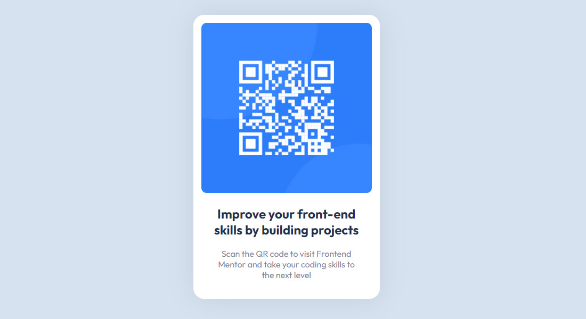

# Frontend Mentor - QR code component solution

This is a solution to the [QR code component challenge on Frontend Mentor](https://www.frontendmentor.io/challenges/qr-code-component-iux_sIO_H). Frontend Mentor challenges help you improve your coding skills by building realistic projects. 

## Table of contents

- [Overview](#overview)
  - [Screenshot](#screenshot)
  - [Links](#links)
- [My process](#my-process)
  - [Built with](#built-with)
- [Author](#author)

**Note: Delete this note and update the table of contents based on what sections you keep.**

## Overview

### Screenshot

### Links

- Solution URL: 
- Live Site URL: 

## My process

### Built with

- HTML
- CSS

## Author

- Website - [AgMarcos5.github.io](https://agmarcos5.github.io)
- Frontend Mentor - [@AgMarcos5](https://www.frontendmentor.io/profile/AgMarcos5)
- Twitter - [@temdi5](https://www.twitter.com/temdi5)
